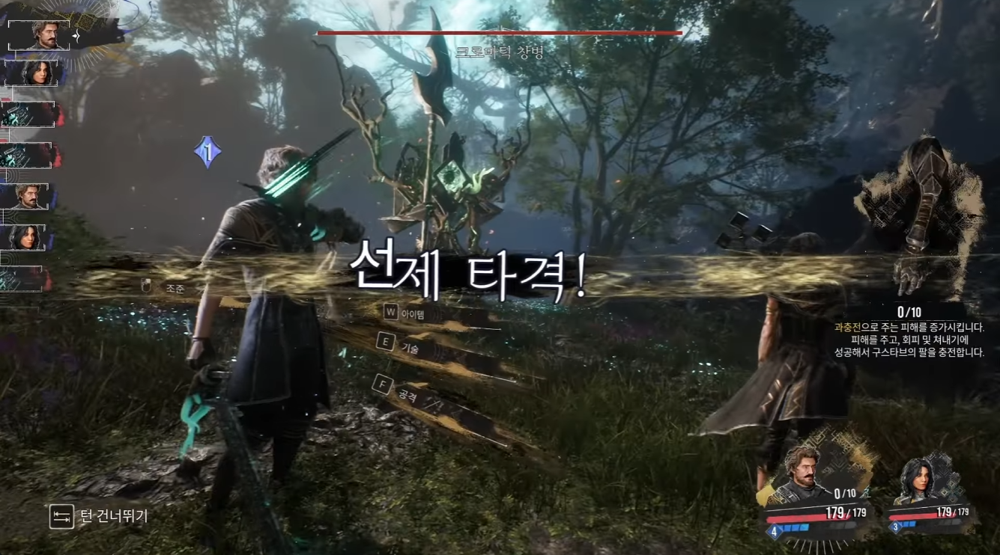

# combat-camera-card-use.md

## 목적

이 문서는 카드 사용 화면의 카메라 뷰와 전투 UI 배치 레퍼런스를 정리한다.

하네스 문서의 수치/규칙을 직접 대체하지 않고, `ARCHITECTURE.md`의 UI Layer, 전투 화면, 카메라 연출 설계 시 참고하는 비주얼 기준으로 사용한다.

## 레퍼런스 이미지

원본 파일:

- `docs/references/visuals/combat-camera-card-use-example.png`

## 화면 의도

카드 사용 화면은 전투 보드가 아니라, 캐릭터와 적이 실제 공간 안에 서 있는 시네마틱 전투 장면처럼 보여야 한다.

플레이어가 카드를 고르는 순간에도 전투 현장감이 유지되어야 하며, UI는 화면을 덮는 카드판이 아니라 현재 선택한 캐릭터의 행동 선택지를 보조하는 형태가 좋다.

## 카메라 기준

| 항목 | 기준 |
| --- | --- |
| 시점 | 3인칭 숄더뷰 또는 후방 사선 카메라 |
| 구도 | 선택 캐릭터는 좌측/하단 전경, 적은 중앙~우측 중경 |
| 거리감 | 카드 UI를 띄워도 캐릭터, 적, 배경 깊이가 유지되어야 함 |
| 전투 정보 | 적 HP/의도는 상단 또는 적 근처, 파티 정보는 좌측/하단에 분산 |
| 선택 강조 | 현재 선택 캐릭터와 사용 가능한 카드/행동이 가장 잘 보여야 함 |

## 카드 사용 UI 기준

- 카드 사용 UI는 선택 파티원의 손패 또는 행동 선택지를 중심으로 표시한다.
- 비선택 파티원은 초상화, 체력, 핵심 상태 정도만 요약한다.
- 행동 큐는 카드 사용 순서가 보이도록 별도 영역에 표시한다.
- 카드 사용 중에도 적 의도와 보스/엘리트 기믹 진행도는 가려지지 않아야 한다.
- 공용 코스트는 항상 확인 가능한 위치에 둔다.

## 프로젝트 적용 방향

현재 프로젝트는 파티원별 개별 덱과 공용 코스트를 사용하므로, 레퍼런스 화면을 그대로 복제하지 않는다.

대신 아래 요소를 우선 차용한다.

- 선택 캐릭터가 전투 공간 안에 실제로 서 있는 느낌
- 적과 플레이어가 같은 3D 공간을 공유하는 구도
- 카드/행동 선택 UI가 시네마틱 구도 위에 얹히는 방식
- 캐릭터 초상화 기반의 파티원 전환 정보
- 큰 행동 또는 필살기 발동 시 화면 중앙 연출 텍스트 사용 가능성

## 주의할 점

- UI가 너무 흩어지면 파티원별 손패와 행동 큐를 이해하기 어려워진다.
- 손패 3명분을 동시에 모두 펼치면 화면이 과밀해진다.
- 레퍼런스처럼 화려한 배경을 사용할 경우 카드 텍스트 가독성이 떨어질 수 있으므로 어두운 반투명 배경, 외곽선, 명도 대비를 함께 설계해야 한다.
- 최초 마스터에서는 고급 카메라 컷보다 고정 카메라, 선택 캐릭터 강조, 행동 큐 가독성을 우선한다.
